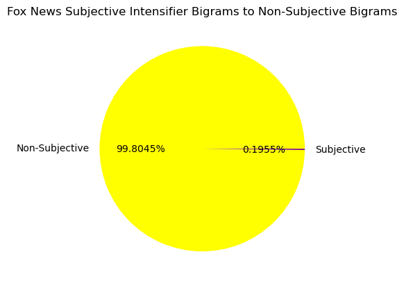
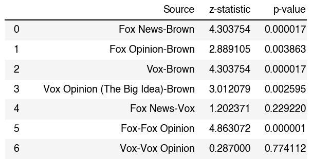

# Fox vs. Vox: A linguistic assessment of subjectivity in U.S. news sources
by Claire McLean

## 0. Introduction
U.S. Americans read news from a variety of different sources. These sources often tend to lean right, left, moderate, or somewhere in between and demonstrate these tendencies in a variety of ways. Further, news sources may tend to report in a subjective manner, as opposed to a strictly objective manner. When consuming news media, it is important to recognize that news sources and individual articles may be subjective in certain ways and may express underlying political views, whether they are intentional or unintentional. Additionally, it is necessary to look critically at the subjectivity of a news source in general in order to select a source that best the individual's interests. This subjectivity can be operationalized linguistically through the analysis of subjective intensifier constructions within a piece of text. Subjective intensifiers are constructions made up of a degree adverb followed by an adjective and imply subjectivity, or a certain level of opinion, within a text. Additionally, many news sources offer 'Opinion' sections, which contain articles that are written to portray the journalists opinions and/or arguments on a topic. These 'Opinion' articles may demonstrate a greater level of subjectivity than their 'Standard' counterparts and serve as another valuable element in an analysis of news subjectivity. Though they are not an all-encompassing measure of subjectivity, subjective intensifier constructions serve as a starting point for a more full-scale analysis and prove to be valuable indicators of opinion in reporting. Additionally, subjective intensifier constructions can be easily analyzed through computational methods. This project serves to compare news source text to non-news source text and assess 1) whether there is a statistically significant difference between the proportion of subjective intensifier constructions to non- subjective intensifier constructions between the 'standard' news articles (non-opinion) and a non-news text, and 2) whether there is a difference in the prevalence of subjective intensifiers between the stardard news articles and the opinion articles from the same sources.

## 1. Background
There is a generally known in the United States that certain news sources are more "biased" than others, and in different directions. This phenomenon is known as "media bias", and involves "unjustable favoritism" in news coverage (Media Bias, 2008). One type of media bias is partisan bias, which involves the favoring of one political party over another. When discussing bias in the media, it becomes necessary to analyze the specific details of a piece that indicate a bias, or general subjectivity. From a linguistic standpoint, there are many ways to operationalize this, including factive verbs, subjective intensifiers, and one-sided terms. Due to time constraints, it proved to be a very difficult feat to attempt to analyze each of these linguistic bias or subjectivity indicators. I decided to choose just one: subjective intensifiers. The choice became clear due to constraints on my ability to operationalize each of these bias indicators. Factive verbs are verbs that "presupposed the truth of their complement clause". Tagging factive verbs and identifying them in a piece of text proves to be a difficult feat, as it becomes necessary to assess the verbs semantically, which is not easily accomplished by a computer. Likewise, one-sided terms are a great indicator of bias, but rely on semantic judgements, which are difficult to compute using technology. The indicator of bias in media that proved to be relatively simple to parse using computational methods was subjective intensifiers, which are made up of an degree adverb followed by an adjective. In English, there are a limited number of degree adverbs, and a handful of them have been studied in relation to the adjective they intensify. These degree adverbs are 'very', 'so', 'quite', and 'too' (Pan, 2021). The CLAWS7 tagset is equipped with tags for degree adverbs, and 'very', 'so', 'quite', and 'too' were shown to be among the most common in the British National Corpus, which was the corpus of the project. Though locating the most common subjective intensifiers in the COCA would have been ideal as this research project focuses on American English, in order to tag these subjective intensifiers properly, I would need a tagging model that has the ability to tag degree adverbs. After many unsuccessful attempts to access and work with the CLAWS7 tagset, I decided to add to the existing research by Pan 2021 and identify the collocations of the 4 aforementioned degree adverbs in the context of American English news articles.

Additionally, it was necessary to choose the specific U.S. news articles that would act as my corpus for this project. I decided to investigate existing U.S media bias spectra to determine which one best fit the needs of my project. The framework of the AllSides Media Bias Chart proved to be effective for this project as it assessses bias alone, not accuracy in reportng. It is also based on inputs from 'ordinary' Americans as well as experts a opposed to an AI model trained to detect bias. As this projects attempts to show how U.S. news sources that are widely known to be biased can have their subjectivity supported by linguistic research, the AllSides Media Bias Chart was ideal. I selected one source from the 'left' side of the bias chart (Vox) and one source from the 'right' side of the bias chart (Fox News) to ensure that the level of bias in each was roughly equal in each direction. The notion of 'equal' levels of bias here is strictly based on their positions in the bias chart and reflects only the perceptions of Americans and not a concrete statistic.

## 2. Data Sourcing
Sourcing the U.S. news article data proved to be a challenging task, as web scraping techniques were necessary to extract it from the sites. After researching and experimenting with an existing Fox News web scraper, I decided to create by own using BeautifulSoup. I built each [scraper](scraping_scripts.ipynb) to extract the article title and the article body text and create a dictionary for each article consisting of these two entries. Each article dictionary was then compiled into a list and a dataframe was created. The article text was then sentence and word tokenized for each news source. The relevant URLs are linked [here](data.md).

Additionally, I needed a corpus of text that would serve as a 'non-subjective' sample. I decided to use the Brown corpus as it contains text from a variety of sources, many of which are not journalistic in nature. Further, I decided to use the Brown corpus as opposed to an 'non-subjective' news source for several reasons. First, it is difficult to identify a news source that lacks any sort of media bias or subjectivity. Second, a source in the middle of the bias spectrum can still be subjective, but in favor of a moderate ideology. The Brown corpus is also readily available as part of the open-source NLTK library, which makes it easily accessible for this project.

## 3. Data cleanup
The data cleaning portion of this project was very straightforward. To begin, I designed the two webscrapers to extract only the data that was relevant for my research project. This eliminated extra data and information that was not necessary. Further, as the BeautifulSoup web scraping process involves the creation of dictionaries, the process of transforming both lists of dictionaries into pandas dataframes was simple. One challenge that arose when initially examining the dataframes was that there were a few extra terms related to encoding such as 'nbsp'. I kept these terms for the majority of my analysis, but removed them, as well as other punctuation symbols to create WordClouds that were visually meaningful. Additionally, it came to my attention that some additional phrases that were not part of the article text body were scraped as well, including links beginning with 'CLICK HERE'. These were also eliminated prior to my analysis using regex across both the Fox and Fox Opinion dataframes. Eliminating these links ensured that the data used in my project was only article text body data.

## 4. Analysis
The goals of this project are 1) whether there is a statistically significant difference between the proportion of subjective intensifier constructions to non- subjective intensifier constructions between the 'standard' news articles (non-opinion) and a non-news text, and 2) whether there is a difference in the prevalence of subjective intensifiers between the stardard news articles and the opinion articles from the same sources. It is also important to note my use of the term 'un-subjective' text in relation to this project. Here, I use the term 'un-subjective' text to refer to bigrams that are not subjective intensifier constructions. Further, the term 'non-news text' refers to the Brown corpus as mentioned earlier. I began my analysis by first gathering some basic statistics of the news article data. The Fox News corpus contained 20442 tokens, and the Fox News Opinion corpus contained 25385 tokens. The Vox corpus contained 31689 tokens, and the Vox Opinion (The Big Idea) corpus contained 48751 tokens. **These values are plotted below in Figure 1.** The Fox News 'standard' corpus is slightly smaller than the Vox 'standard' corpus, and the 'opinion' corpora are larger in terms of token count than their 'standard' counterparts.

#### Figure 1

#### The analysis portion of this project is divided into 3 parts: unigram analysis, bigram analysis, subjective intensifer analysis,and a final comparison of subjective intensifier data

### Unigram Analysis
When assessing the most common unigrams in each of the corpora, it came as no surprise that stopwords and punctuation symbols are the most common. The Jupyter Notebook section for the unigram distribution is available [here](https://nbviewer.jupyter.org/github/Data-Science-for-Linguists-2025/News-Bias-Assessment/blob/main/data-pipeline.ipynb#Part-3:-Unigram-analysis). The encoding term 'nbsp' was also a frequent unigram in the Fox News Opinion corpus. The WordClouds below demonstrate the most common unigrams in each corpus. In order to visualize these unigram frequencies in a meaningful way, I removed stopwords and most punctuation symbols in the WordClouds, leaving only words that carry substantial meaning. In further analyses, the stopwords and punctuation are kept. **Figures 2, 3, 4, and 5 demonstrate the most common non-punctuation and non-stopword unigrams in each corpus.**

#### Figure 2

#### Figure 3

#### Figure 4

#### Figure 5

As shown by the figures above, some common unigrams across all 4 corpora include 'trump' and 'president', though their specific frequencies vary across each corpus. As all 4 corpora are sourced from the 'Politics' section of each news source, these frequent unigrams signal the political nature of each corpus. Additional words with high frequencies are 'fox', 'news', and 'government' in both the Fox News and Fox News Opinion corpora, and 'one' and 'court' in both the Vox and Vox Opinion (The Big Idea) corpora. This step in my analysis proved to be beneficial for this project as it gives contextual insight into the types of bigrams that will be found in the bigram analysis portion of the project.

### Bigram Analysis
The bigram analysis portion of this project along with the conditional frequencies of different bigrams also gives substantial exploratory insight into the content of the corpora and paves the way for an effective bigram analyisis of the subjective intensifier constructions. The Jupyter Notebook section for the bigram distribution is available [here](https://nbviewer.jupyter.org/github/Data-Science-for-Linguists-2025/News-Bias-Assessment/blob/main/data-pipeline.ipynb#Part-4:-Bigram-Analysis). Though the unigram and bigram analysis are mostly exploratory, they are necessary steps in understanding the data. In the bigram analysis, stopwords and punctuation are maintained. As the word 'trump' was very common in all 4 corpora, a conditional frequency analysis was conducted to retrieve the most common words following 'trump'. The conditional frequency distribution took only the instances of 'trump' with the part-of-speech tag 'NN' (noun) to ensure that these bigrams relate to the U.S. President and not the verb 'trump'. **Figures 6, 7, 8, and 9 below demonstrate these conditional frequency distributions.**

#### Figure 6

#### Figure 7

#### Figure 8

#### Figure 9

In the above plots, the word 'administration' appears to be a very common word following the word 'trump'. Additionally, words like 'touts', 'hammered', 'publicly', 'unceremoniously' and 'risks' in the Fox News and Fox News Opinion WordClouds suggest a deeper level of subjectivity that goes beyond the scope of subjective intensifiers. The Vox and Vox Opinion (The Big Idea) corpora contain words such as 'hyped', 'denied', 'claims' and 'blamed', which also suggest a deeper level of subjectivity. These words all carry semantic connotations that could be used in future research to investigate subjectivity in a different way. Though the conditional frequency distribution analysis of words following 'trump' is strictly exploratory, it demonstrates that the notion of linguistic subjectivity goes deeper than subjective intensifiers alone.

### Subjective intensifiers
As the main research questions of this project relate to subjective intensifier data specifically, it is necessary to analyze the distribution of each of the four subjective intensifiers: 'very', 'so', 'quite', and 'too' in all 4 corpora. This was accomplished by first creating lists of all words following each of 4 subjective intensifiers in all 4 corpora, with the addition of the Brown corpus which stands as the non-news text against which each of the 4 corpora are compared. Following the creation of the lists, conditional frequency distributions were then constructed and plotted. However, s this research project focuses mainly on the raw frequencies of all subjective intensifier constructions, the frequency of each *specific* adjective following each of the 4 subjective intensifiers was not necessary for the final analysis. The frequency distribution was conducted strictly as an exploratory measure. The Jupyter Notebook section for the subjective intensifier analysis is available [here](https://nbviewer.jupyter.org/github/Data-Science-for-Linguists-2025/News-Bias-Assessment/blob/main/data-pipeline.ipynb#Part-5:-Subjective-intensifiers). **Figures 10, 11, 12, and 13 below demonstrate the frequency distributions of all 4 subjective intensifiers across all 4 corpora. As the Brown corpus subjective intensifier data is strictly used for the purpose of frequency comparision, it was not plotted**.

#### Figure 10

#### Figure 11

#### Figure 12

#### Figure 13

As shown in the above plots, words such as 'many' and 'much' were common across all 4 corpora. As these are very common words in English, it is not surprising that they would be frequent in all of the corpora. 

The next step of the analysis is obtaining frequencies of all subjective intensifier constructions in the 4 news corpora and the Brown corpus. In terms of the frequency of subjective intensifier constructions in the corpora, there were 40 constructions in the Fox News corpus, 11 constructions in the Fox News Opinion Corpus, 48 constructions in the Vox corpus, 70 constructions in the Vox Opinion (The Big Idea) corpus, and 1154 constructions in the Brown corpus. These numbers alone cannot be compared to one another as each corpus was a different size, as shown [here](https://nbviewer.jupyter.org/github/Data-Science-for-Linguists-2025/News-Bias-Assessment/blob/main/data-pipeline.ipynb#Part-2:-Linguistic-analysis-of-data). These values can however, be used to create subjective intensifier to non-subjective intensifier bigram proportions for each of the 5 corpora (including the Brown corpus). These proportions allow for comparison of subjective intensifier frequencies across the corpora. These proportions are calculated in the following section.

### Final comparison of subjective intensifier data
The final step in the analysis portion of this project is to compare the subjective intensifier to non-subjective intensifier bigram proportions across the corpora. The Jupyter Notebook section for the final comparison of the subjective intensifier data is available [here](https://nbviewer.jupyter.org/github/Data-Science-for-Linguists-2025/News-Bias-Assessment/blob/main/data-pipeline.ipynb#Part-6:-Final-comparison-of-subjective-intensifier-data). Two different statistical analyses were conducted to accomplish this task: 1) a proportion comparison(rounded to the 4th decimal place), and 2) proportion z-tests between the Fox News corpus and the Brown corpus, the Vox corpus and the Brown corpus, the Fox Opinion corpus and the Brown corpus, the Vox Opinion (The Big Idea) corpus and the Brown corpus, and finally the Fox News (standard) corpus and the Vox (standard) corpus. The z-test serves as an effective way to measure whether there is a significant difference between two different proportions. For my purposes, I used a series of two-sample proportion z-tests. **Figures 14, 15, 16, 17, and 18 below demonstrate the proportions of subjective intensifier bigrams to non-subjective intensifier bigrams.**

#### Figure 14

#### Figure 15

#### Figure 16

#### Figure 17

#### Figure 18

The above figures show slight differences in the proportions of subjective intensifier bigrams to non-subjective intensifier bigrams. To begin, when comparing Fox News to Fox News Opinion, 0.1966% of the Fox News bigrams were subjective intensifiers while 0.0434% of the Fox News Opinion bigrams were subjective intensifiers. This is an interesting result as I hypothesized that the 'opinion' articles would have a higher percentage of subjective intensifiers. Next, when comparing Vox to Vox Opinion (The Big Idea), 0.1514% of the Vox bigrams were subjective intensifiers while 0.1435% of the Vox Opinion (The Big Idea) bigrams were subjective intensifiers. These percentages are quite similar with the opinion articles having a slightly smaller subjective intensifier percentage, which also disproves my initial hypothesis that the 'opinion' articles would have a higher percentage of subjective intensifiers. The percentage of subjective intensifiers in the Brown corpus is 0.0993%, which is among the lowest of subjective intensifier bigram percentages, aside from the Fox News Opinion percentage at 0.0434%. In total, all of the corpora except for Fox News Opinion had a higher percentage of subjective intensifiers than the Brown corpus, which supports the notion that news articles would contain a level of subjectivity that is higher than the level in a non-news corpus.

The two-sample proportion z-tests also support the finding that news articles contain higher frequencies of subjective intensifiers than the Brown corpus. **Figure 19 below demonstrates the two-sample z-test results:**

#### Figure 19

Figure 19 above shows the results of proportion z-tests for every news corpus compared with the Brown corpus and the Fox News corpus compared to the Vox corpus. As shown, there was a statistically significant difference in the proportions of subjective intensifier bigrams to non- subjective intensifier bigrams between each news corpus, both the standard and opinion versions, and the non-news Brown corpus. The test compared the standard news corpora with their opinion counterparts and demonstrated that the proportion of subjective intensifiers was higher in the standard Fox News corpus than it was in the Fox News Opinion corpus, and there was no statistically significant difference in the same measures for the Vox and Vox Opinion corpora. Additionally, there was not a statistically significant difference between the proportion of subjective intensifier bigrams to non- subjective intensifier bigrams between the Fox News Corpus and the Vox corpus, even though their respective proportions differ.

## 5. Conclusion
This analysis serves to answer the questions of how the subjective intensifier data of news sources compares to the subjective intensifier data of a non-news source and whether there is a difference between the frequency of subjective intensifier bigrams between 'standard' and 'opinion' news sources. It is important to note first and foremost that the overall low bigram token counts of subjective intensifiers across all sources and the small number of articles (25) per source limit this project greatly. However, this project does provide valuable insight into subjective tendencies in news reporting. As demonstrated in the above analysis, the 'standard' news sources of Fox News and Vox demonstrate a proportion of subjective intensifier bigrams to non-subjective intensifier bigrams that is significantly different (p < 0.05) from the proportion of subjective intensifier bigrams to non-subjective intensifier bigrams in the Brown corpus, or the non-news source. Comparisions between the proportions of subjective intensifier bigrams to non- subjective intensifier bigrams show that in all 4 cases where a news source was compared to the Brown corpus (Fox News - Brown, Fox News Opinion - Brown, Vox - Brown, Vox Opinion (The Big Idea) - Brown), the proportion of subjective intensifier bigrams was significantly higher in the news sources than it was in the Brown corpus. This assessment demonstrates that there is indeed a higher level of linguistic subjectivity in news sources than there is in a non-news source. Further, an additional two-sample proportion z-test was conducted to compare subjective intensifier bigram proportions between the two standard news sources: Fox News and Vox. The test indicated that there was not a statistically significant difference in these proportions between the two standard news sources which are situated, according to the AllSides Media Bias chart. Lastly, the analysis demonstrates that the subjective intensifier bigram to non- subjective intensifier bigram proportion is lower in the Fox Opinion corpus than the standard Fox corpus, and there was no statistically significant difference found in the same proportion between the Vox and Vox Opinion (The Big Idea) corpora. Though this linguistic subjectivity investigation is far from a full-scale assessment of subjectivity, it can provide valuable insight into the presence of linguistic subjectivity within news sources. Further, this analysis serves to demonstrate that subjectivity cannot be predicted by the political direction of a news source. Future research that investigates additional indicators of subjectivity and/or bias such as factive verbs or one-sided terms is necessary to develop a more comprehensive assessment of linguistic bias. Additional directions that can be followed to supplement this project could include an analysis of different news sources and additional non-news corpora, as well as an analysis of additional linguistic indicators of bias.

## 6. Pitfalls and setbacks
This project experienced many setbacks and false starts, many of which related to data sourcing. At first, I attempted to use what I believed was a corpus of subjective intensifier data that I could use to compare with my found news data. However, this turned out to be part of TreeBank corpus that was not publicly available so I needed to find a different way to identify subjective intensifiers. I accomplished this by doing a POS-tagged bigram analysis instead, and using the Brown Corpus as a 'non-subjective' text to compare with the news source corpora. Additionally, I experienced some issues with my Jupyter Notebook kernel when attempting to plot bigram frequency distributions. For this reason, no bigram frequencies are plotted.

## 7. References
 (2008). Media bias. In L. L. Kaid, C. Holtz-Bacha (Eds.) Encyclopedia of political communication (Vol. 2, pp. 434-440). SAGE Publications, Inc., https://doi.org/10.4135/9781412953993.n387

 Recasens, M., Danescu-Niculescu-Mizil, C., & Jurafsky, D. (2013). Linguistic Models for Analyzing and Detecting Biased Language. Proceedings of the 51st Annual Meeting of the Association for Computational Linguistics, 1650–1659
 
 Pan, Y. (2022). Intensification for discursive evaluation: a corpus-pragmatic view. Text & Talk, 42(3), 391-417.